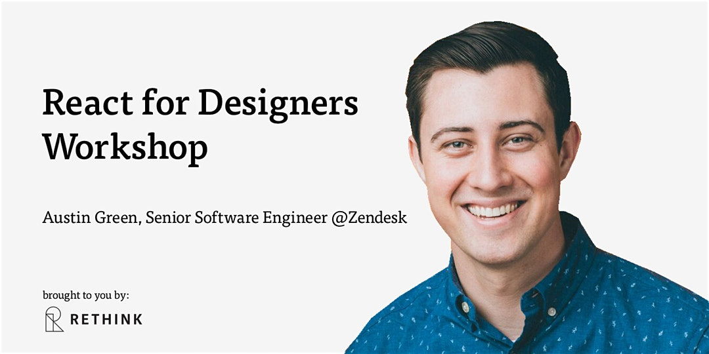

# Prototyping with React and Design Systems

Welcome to Rethink! This repository includes supplemental materials to our in-person workshop.

## Table of Contents

- [Prerequisites](#prerequisites)
- [Topics Covered](#topics-covered)
- [System Requirements](#system-requirements)
- [Exercises](#exercises)

## Prerequisites

The most important thing is to be comfortable with JavaScript and basic web development. A basic understanding of HTML, CSS, and JavaScript is preferable.

[Learn JS](https://www.learn-js.org/) and [Learn HTML](https://www.learn-html.org/) are a helpful refresher and will cover the technical proficiency you would need to know before attending the workshop.

## Topics Covered

1. Front-end basics
2. React basics and interaction patterns
3. Live prototype tooling
4. Transition designs to React
5. Use a design system to create component boundaries
6. Rapid prototyping with [utility-first CSS](https://tailwindcss.com/)

We will dive into each of the topics above with live-coding exercises

## System Requirements

All exercises will be ran in a web environment.

- Laptop and charger
- Latest version of [Google Chrome](https://www.google.com/chrome/)

## Exercises

- [Intro to React](#)
- [Todo application](#)
